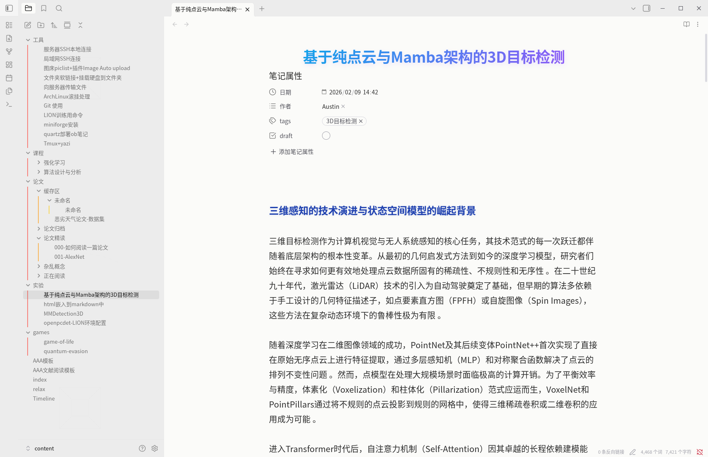
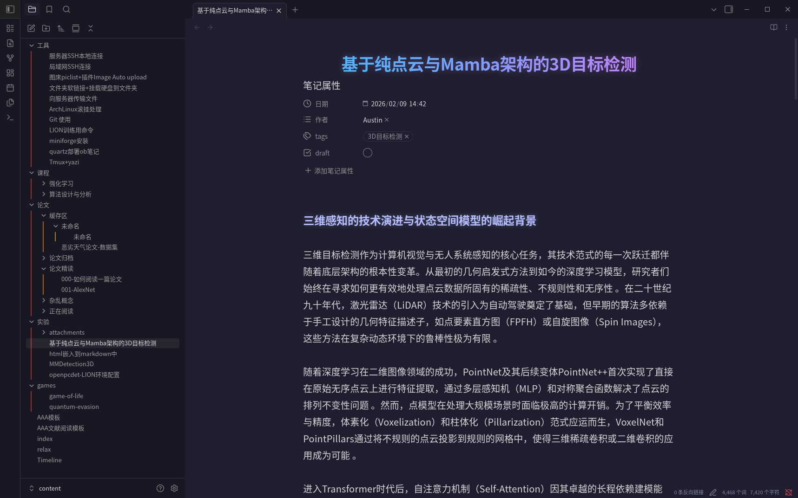
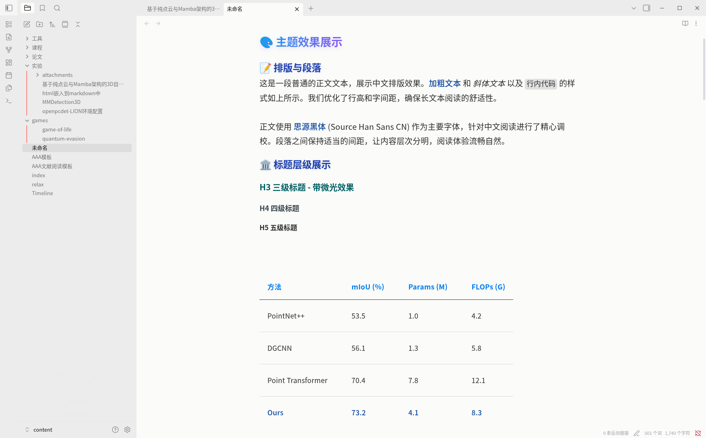

# AAAA - Obsidian 主题

> 一款优化中文阅读体验的 Obsidian 主题，基于 Minimal Theme 修改。

[🇺🇸 **English**](./README.md)

---

## 📸 截图

### 亮色模式

### 暗色模式

### 样式细节

---

## ✨ 特性

### 🎨 视觉设计
- **渐变标题** - H1 标题使用优雅的蓝紫渐变色
- **彩虹大纲线** - 不同层级的大纲使用彩虹色区分，增强文档结构可视性
- **统一配色** - 深色/浅色模式均经过精心调校

### 📖 阅读体验
- **中文字体优化** - 使用思源黑体 (Source Han Sans CN)
- **舒适行宽** - 优化的文章行宽，避免单行过长导致阅读疲劳
- **行高与间距** - 调整行高和段落间距，提升长文阅读舒适度

### 💻 代码与表格
- **代码块美化** - FiraCode 等宽字体，中文 fallback 到思源黑体
- **简洁表格** - 仿 LaTeX booktabs 风格，去除纵向边框

---

## 📦 字体要求

为获得最佳体验，建议安装以下字体：

- **思源黑体** (Source Han Sans CN) - [下载地址](https://github.com/adobe-fonts/source-han-sans/releases)
- **FiraCode Nerd Font** (可选，用于代码) - [下载地址](https://www.nerdfonts.com/font-downloads)

---

## 🛠️ 安装

1. 复制文件夹到 `.obsidian/themes/AAAA/`
2. **设置** > **外观** > **主题** > 选择 **AAAA**

---

  Made by Austin Suun

